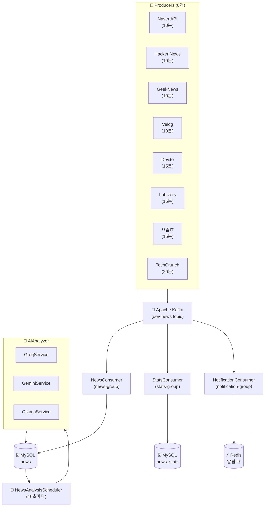

# TrendStream


> IT 뉴스 수집 및 AI 분석 플랫폼

국내외 8개 소스에서 IT 뉴스를 실시간 수집하고, AI가 분석하여 요약/키워드/트렌드를 제공합니다.

## 주요 기능

- **멀티 소스 뉴스 수집**: Kafka 기반 8개 소스 병렬 수집
- **AI 뉴스 분석**: 요약, 감정 분석, 키워드 추출, 중요도 점수
- **실시간 트렌드**: 키워드 빈도 기반 트렌드 순위
- **키워드 구독 알림**: 관심 키워드 등록 시 새 뉴스 알림
- **통계 대시보드**: 소스별/시간별/일별 뉴스 통계

## 기술 스택

### Backend
- Java 21, Spring Boot 3.x
- Spring Data JPA, Spring Kafka
- MySQL 8.0, Redis 7

### AI 분석
- Groq API (LLaMA 3.1)
- Google Gemini API
- Ollama (로컬 LLM)

### Infrastructure
- Docker, Docker Compose
- Apache Kafka, Zookeeper

### Frontend
- (별도 저장소)

## 기술 선택 이유

### Kafka - 메시지 큐
| 요구사항 | Kafka 선택 이유 |
|---------|----------------|
| 다중 Producer | 8개 뉴스 소스가 독립적으로 메시지 발행 |
| 다중 Consumer | 동일 메시지를 DB 저장, 통계 집계, 알림 발송에서 각각 소비 |
| 느슨한 결합 | Producer/Consumer가 서로 알 필요 없이 독립 동작 |
| 확장성 | 새 소스/Consumer 추가 시 기존 코드 수정 불필요 |

**Consumer Group 활용**: 같은 토픽을 3개 Consumer Group이 독립적으로 소비하여 하나의 뉴스가 저장, 통계, 알림에 각각 활용됩니다.

### Redis - 인메모리 저장소
| 요구사항 | Redis 선택 이유 |
|---------|----------------|
| TTL (Time To Live) | 알림 중복 방지 키를 1시간 후 자동 삭제 |
| 빠른 조회 | 모든 뉴스마다 중복 체크 필요 (μs 단위 응답) |
| 알림 큐 | List 자료구조로 배치 발송용 큐 구현 |

**MySQL 대비 장점**: TTL을 위해 별도 스케줄러 불필요, 메모리 기반으로 조회 속도 100배 이상 빠름

### AI Provider 전환 (Strategy 패턴)
```
AiAnalyzer (인터페이스)
    ├── GroqService    → 클라우드 LLM (빠름, 무료 한도 있음)
    ├── GeminiService  → Google AI (고품질, 분당 15회 제한)
    └── OllamaService  → 로컬 LLM (무제한, GPU 필요)
```

| 설정 | 용도 |
|-----|------|
| `ai.provider=groq` | 기본값, 빠른 응답 |
| `ai.provider=gemini` | 고품질 분석 필요 시 |
| `ai.provider=ollama` | API 한도 없이 로컬 처리 |

**배치 처리로 API 80% 절감**: 뉴스 3개를 묶어서 1회 API 호출 (개별 호출 대비 비용/한도 효율화)

## 아키텍처



## 뉴스 소스

| 소스 | 유형 | 수집 방식 | 주기 |
|-----|------|----------|------|
| Naver | 뉴스 | REST API | 10분 |
| Hacker News | 커뮤니티 | Firebase API | 10분 |
| GeekNews | 커뮤니티 | RSS | 10분 |
| Velog | 블로그 | RSS | 10분 |
| Dev.to | 블로그 | RSS | 15분 |
| Lobsters | 커뮤니티 | RSS | 15분 |
| 요즘IT | 뉴스 | RSS | 15분 |
| TechCrunch | 뉴스 | RSS | 20분 |

## 시작하기

### 사전 요구사항

- Java 21+
- Docker, Docker Compose
- (선택) Ollama - 로컬 LLM 사용 시

### 환경 변수 설정

프로젝트 루트에 `.env` 파일 생성:

```env
# Database
DB_PASSWORD=

# Naver API
NAVER_CLIENT_ID=
NAVER_CLIENT_SECRET=

# AI Provider (groq, gemini, ollama 중 택1)
AI_PROVIDER=groq

# Groq API (권장)
GROQ_API_KEY=

# Gemini API (대안)
GEMINI_API_KEY=

# CORS
CORS_ALLOWED_ORIGINS=http://localhost:3000
```

### 실행

```bash
# 1. 인프라 실행 (MySQL, Kafka, Redis)
docker-compose up -d

# 2. 애플리케이션 실행
./gradlew bootRun

# 3. Swagger UI 확인
open http://localhost:8081/swagger-ui.html
```

## API 엔드포인트

### 뉴스 API
| Method | Endpoint | 설명 |
|--------|----------|------|
| GET | `/api/news` | 뉴스 목록 (페이지네이션) |
| GET | `/api/news/{id}` | 뉴스 상세 |
| GET | `/api/news/search?keyword=xxx` | 키워드 검색 |
| GET | `/api/news/popular` | 인기 뉴스 (AI 점수순) |
| GET | `/api/news/category?name=xxx` | 카테고리별 뉴스 |
| GET | `/api/news/source?name=xxx` | 소스별 뉴스 |

### 트렌드 API
| Method | Endpoint | 설명 |
|--------|----------|------|
| GET | `/api/trends?period=24h&limit=10` | 트렌드 키워드 |

### 통계 API
| Method | Endpoint | 설명 |
|--------|----------|------|
| GET | `/api/stats/dashboard` | 대시보드 종합 |
| GET | `/api/stats/sources` | 소스별 통계 |
| GET | `/api/stats/hourly` | 시간별 통계 |
| GET | `/api/stats/daily` | 일별 통계 |

### 구독 API
| Method | Endpoint | 설명 |
|--------|----------|------|
| POST | `/api/subscriptions` | 키워드 구독 |
| GET | `/api/subscriptions?email=xxx` | 내 구독 목록 |
| DELETE | `/api/subscriptions` | 구독 취소 |

## 프로젝트 구조

```
src/main/java/com/example/trendstream/
├── config/                 # 설정 (Kafka, Redis, AI)
├── controller/             # REST API
├── domain/
│   ├── entity/            # JPA 엔티티
│   ├── enums/             # Enum
│   └── vo/                # Value Object
├── dto/                    # DTO
├── repository/             # JPA Repository
├── service/
│   ├── ai/                # AI 분석 (Groq, Gemini, Ollama)
│   ├── consumer/          # Kafka Consumer (3개)
│   ├── producer/          # Kafka Producer (8개)
│   └── scheduler/         # 스케줄러
└── util/                   # 유틸리티 (HtmlUtils, SpamFilter)
```

## 인프라 포트

| 서비스 | 포트 | 설명 |
|--------|------|------|
| Spring Boot | 8081 | 애플리케이션 |
| MySQL | 3307 | 데이터베이스 |
| Kafka | 9092 | 메시지 큐 |
| Kafka UI | 8080 | Kafka 모니터링 |
| Redis | 6379 | 캐시/큐 |
| Zookeeper | 2181 | Kafka 코디네이터 |

## AI 분석 결과 예시

```json
{
  "summary": "Spring Boot 4.0이 출시되어 가상 스레드를 기본 지원하며...",
  "sentiment": "POSITIVE",
  "keywords": ["Spring Boot", "Virtual Threads", "Java 21"],
  "score": 85
}
```

## 트러블슈팅

자세한 개발 기록 및 트러블슈팅은 [TROUBLESHOOTING.md](./TROUBLESHOOTING.md)를 참고하세요.

## 라이선스


## 기여자

| 이름 | 역할 | GitHub |
|-----|------|--------|
|  |  |  |

## 관련 링크

- Frontend Repository:
- 배포 URL:
- 블로그/회고:
